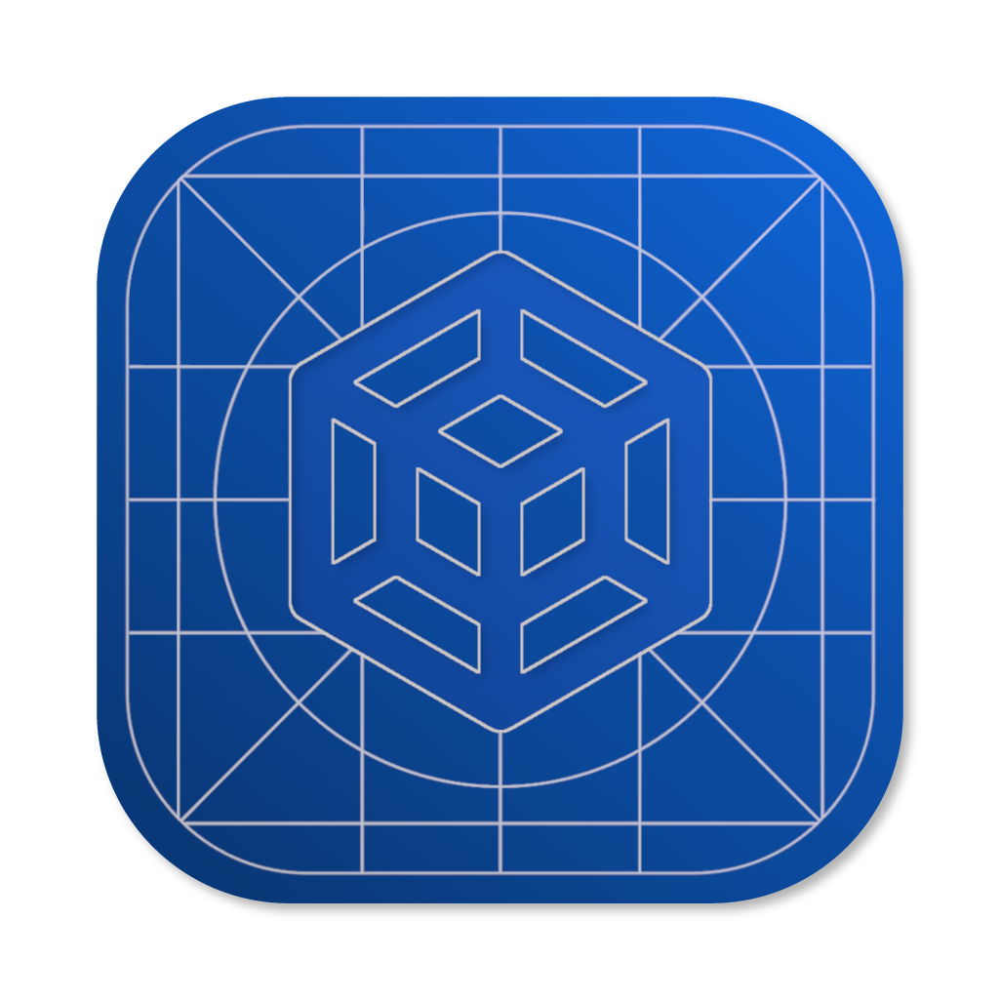

# VirtualizationKit

<div align="center">
  

  <p>Welcome to <strong>VirtualizationKit</strong><br>The revolutionary framework for easy Virtualization on macOS.</p>
</div>

## Introduction

`VirtualizationKit` currently supports Apple Virtualization Framework, and its architecture is built and ready to accommodate additional backends (for example, QEMU) with minimal friction. The primary goal is to offer a streamlined interface to manage virtual machines without needing to deal with the higher complexity that comes with virtualization back-ends.

### Design Implications
- A **minimal** and **simple to use** API that wraps the complexity of virtualization and reduces boilerplate code.
- Defaults that *“just work”* for the majority of use cases, from basic Linux VMs to more complex setups.
- Advanced features for niche, specialized scenarios from the underlying back-ends may not be available.
- Currently optimized around Apple virtualization. Broader hypervisor support is on the roadmap.

> [!TIP]
> **Target Audience**
> - **Developers new to Virtualization**: Gentle learning curve for those unfamiliar with system-level APIs.
> - **Teams seeking quick setup**: For those contexts where spinning up VMs should be simple and repeatable.
> - **Users wanting abstraction**: Consistent, streamlined API over multiple vendor-specific solutions.

---

## Potential API Design Goals

> [!WARNING]
> To be able to use this framework, please make sure your system meets the following requirements:
> 
> - **Processor**: Apple Silicon (M1, M2, or newer)   
> - **Operating System**: macOS Sonoma 14.0 or later

### Helper Objects and Methods
- Encapsulate complex tasks in user-friendly functions and data structures.

**Example (using Apple as a concrete backend and Combine for state subscriptions):**
```swift
import VirtualizationKit
import Combine

// 1. Create a simple template
let myAwesomeTemplate = Template(
    name: "MySampleVM",
    os: .linux,
    ram: 4096,
    cpu: 3,
    ...
)

// 2. Initialize an Apple-based VM
let vm = AppleVirtualMachine(template: myAwesomeTemplate)

// 3. Subscribe to state updates
var cancellables = Set<AnyCancellable>()
vm.stateSubject
    .sink { state in
        switch state {
        case .install(let progress): print("Installation at: \(progress)")
        case .running:               print("VM is running")
        case .stopped:               print("VM stopped")
        }
    }
    .store(in: &cancellables)

// 4. Perform installation asynchronously
Task {
    do {
        try await vm.execute(action: .install)
        print("Installation completed successfully!")
    } catch {
        print("Installation failed: \(error.localizedDescription)")
    }
}
```

### Sensible Defaults
- Provide ready-to-use configurations for common virtualization needs—like typical CPU, memory, and disk settings—so users can get started with minimal code.

### Simplified Error Handling
- Mask low-level error codes with approachable descriptions and actionable suggestions.

  **Example:**
  ```swift
  do {
      try await vm.execute(command: .start)
  } catch {
      print("Failed to start VM: \(error.localizedDescription)")
  }
  ```
---
## Contact

For any inquiries or feedback, please feel free to contact me at <a href="mailto:help@grocco.org">help@grocco.org</a>
